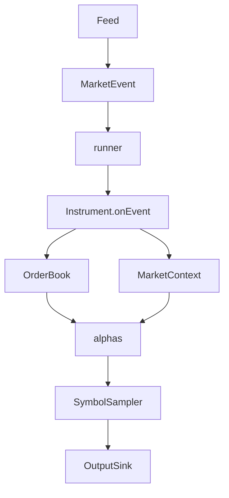

# market replay with alpha analytics

An event-driven engine that reconstructs the order book from tick-by-tick NASDAQ ITCH 5.0 market data and runs **alphas** on top.

It is a **research / analysis engine**, not a trading strategy.\
It replays the feed, computes alphas, and dumps leading data for offline study (e.g. correlation analysis).

## What it does
- Parses NASDAQ TotalView-ITCH 5.0 binary to get the historical event stream.
- Reconstructs an L3 / market-by-order book per symbol.
- Runs and records configured alphas on each update.
- Optional inspection dumps (raw feed / order-book snapshots).
- Configurable sampling rate to expose multiple market scenarios without flooding records.

## Build

Requirements: a C++20 compiler (GCC 10+ or Clang 12+) and CMake 3.16+. There are no dependencies to install, the only third-party library (nlohmann/json) is packaged in `third_party/`.

```bash
cmake -S . -B build      # configure (run once)
cmake --build build -j   # compile
```

This produces the `engine` executable at `build/engine`

## Run

Fetch the sample NASDAQ feed from [emi.nasdaq.com](https://emi.nasdaq.com/ITCH/Nasdaq%20ITCH/01302020.NASDAQ_ITCH50.gz) and decompress it:

```bash
gunzip -c 01302020.NASDAQ_ITCH50.gz > 01302020.NASDAQ_ITCH50
./build/engine --config example.json 01302020.NASDAQ_ITCH50
```

The engine replays from the start of the file to warm each book, then **stops at the
config's `endTime`** and writes rows only at/after `startTime`. So pointing it at a
full trading day is fine.

## Configuration

A run is fully described by the JSON config (a copy is written to the output dir for
reproducibility). Keys:

| key              | type     | meaning                                                                 |
|------------------|----------|-------------------------------------------------------------------------|
| `symbols`        | string[] | instruments to watch; empty or omitted = all symbols in the feed        |
| `alphas`         | object[] | alphas to run, in order (required, non-empty)                       |
| `samplingRate`   | int      | write one row every N events per symbol (default 1, write all)      |
| `output`         | string   | output dir; `<datetime>` template will be auto-populated (default `out/<datetime>`) |
| `leads`          | object[] | lead data (a channel's value at `t+delay`)              |
| `rawFeed`        | bool     | also dump per-symbol input events + a global `feed.csv` (default false) |
| `orderBook`      | bool     | also dump per-symbol order-book snapshots (default false)               |
| `orderBookDepth` | int      | levels per side in the book dump (default 20)                           |
| `startTime`      | string   | output window start, `HH:MM:SS[:nnnnnnnnn]` time-of-day                 |
| `endTime`        | string   | replay stop time                                         |

Each `alphas[]` entry is `{ "source": <registry name>, "name"?: <label, default = source>,
"params"?: { … } }`. `source` selects the registered alpha; `name` labels its output
columns and is how `leads` refer to it.

Each `leads[]` entry is `{ "source", "channel"?, "delayNs" | "delayTicks", "transform"?:
raw|return, "name"? }`.

See the bundled [`example.json`](example.json) and [`inspect.json`](inspect.json) for a full examples.

## Outputs

- `<SYMBOL>.csv`: sampled alpha rows (one column per alpha channel + each lead).
- `config.json`: a copy of the run config.
- `<SYMBOL>.feed.csv`, `feed.csv`: per-symbol and market-wide raw events (`rawFeed`).
- `<SYMBOL>.book.csv`: per-event order-book snapshots (`orderBook`).

Inspection dumps are **per-event** (they ignore `samplingRate`) and join to the sampled rows on the event-index.

## Architecture



## Adding an alpha

1. Create `src/alphas/foo_alpha.cpp`: subclass `Alpha`, override the relevant hooks (`onBookUpdate`, `onTrade`, etc.), and declare the output dimensions in the constructor.
2. Register it in the same file with `HFT_REGISTER_ALPHA_SIMPLE("foo", FooAlpha)` (or `HFT_REGISTER_ALPHA` for params/dependencies).
3. Only if another alpha must depend on its concrete type, split the class into a `foo_alpha.h` header (registration stays in the `.cpp`). e.g. `imbalance_alpha.h`.
4. Build (CMake globs `src/alphas/*.cpp` automatically) and use `"foo"` in the config's `alphas` list.


